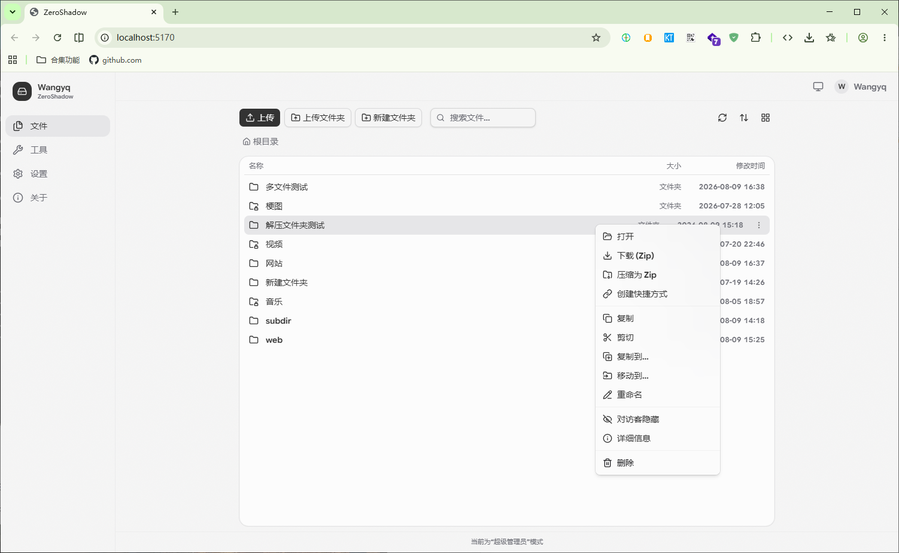
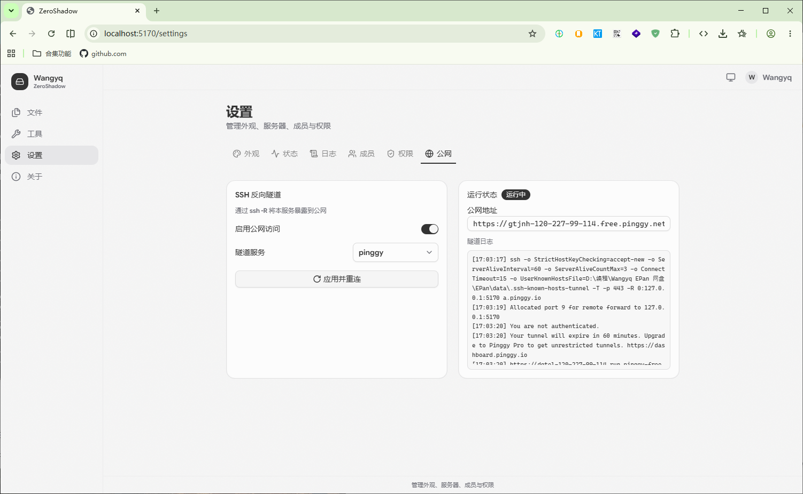
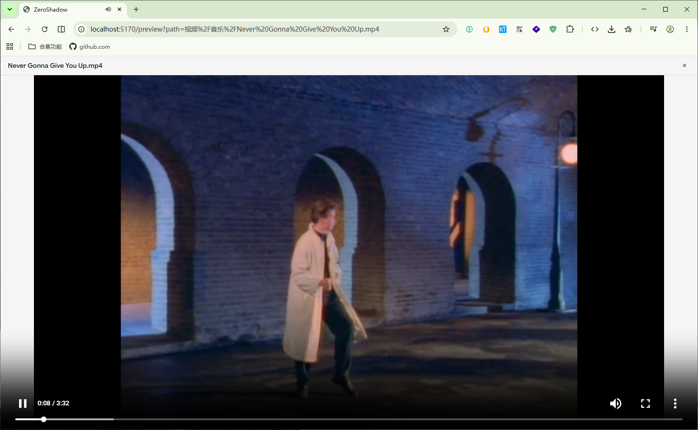
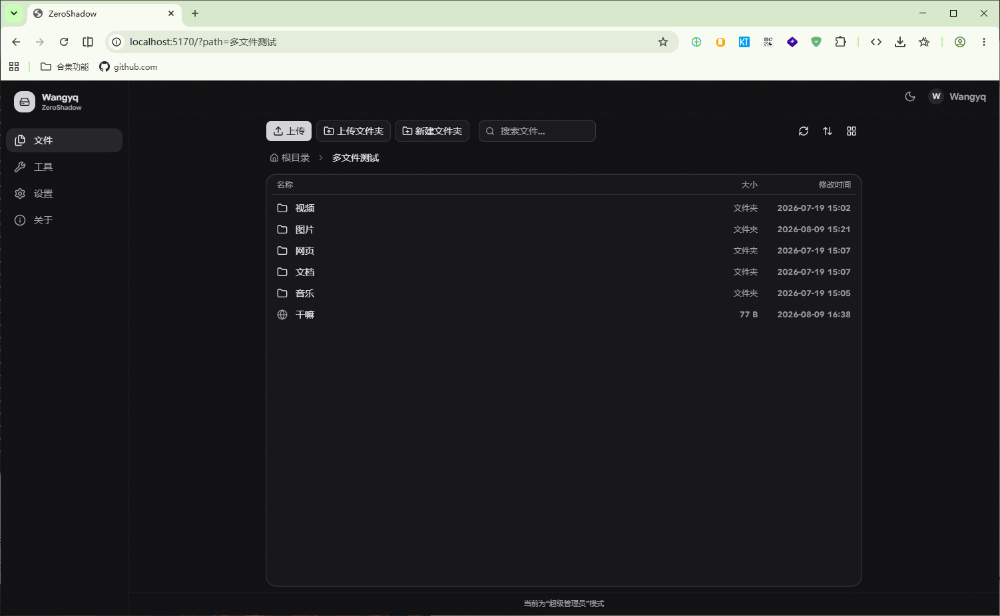

<a id="top"></a>

<h1 align="center">ZeroShadow</h1>

<p align="center">
  <strong>轻量级局域网网盘, 一款极简好用的工作室网盘</strong>
</p>

<p align="center">
  
  
  
  
  
</p>

---

> **ZeroShadow** 是一款基于 Node.js + React 的轻量工作室文件共享应用, 类似私有网盘, 支持局域网文件共享与公网穿透访问。内置三级权限体系（超级管理员 / 团队成员 / 访客），确保文件安全可控。

---

## 截图预览

<div align="center">
  
  <p><em>图 1：文件浏览器（列表/网格视图、右键菜单、多选操作）</em></p>


  <p><em>图 2：超管设置 —— 权限管理 & SSH 公网隧道</em></p>


  <p><em>图 3：文件预览（图片 / 视频 / PDF / 文本）</em></p>


  <p><em>图 4：暗色模式</em></p>
</div>

---

## 功能特性

### 文件管理

- **上传** 批量文件 / 文件夹拖拽上传，支持超大文件(超级管理员可设定限制)
- **下载** 单文件流式下载 / 文件夹 ZIP 打包下载（可配置大小上限）
- **预览** 图片缩放拖拽、音视频播放、PDF 内嵌、文本高亮、HTML 渲染
- **编辑** 在线文本编辑器，支持保存回写
- **操作** 复制、粘贴、移动、重命名、删除（均支持覆盖/合并策略）
- **搜索** 递归全目录搜索
- **软路由** 将其他目录定向到网盘，无需复制
- **工具** 内置多线程下载工具, 方便后台挂载下载大文件
- **开箱即用** 无需配置过多内容, 服务器Windows/Linux, 客户端仅需现代浏览器
- **压缩/解压** 在线 ZIP 压缩与解压

### 权限体系

> 提示: 下文"可配"指的是超级管理员可在权限设置自由调整。

| 角色        | 浏览  | 下载  | 上传           | 编辑  | 管理  | 设置    |
|:--------- |:---:|:---:|:------------:|:---:|:---:|:-----:|
| **超级管理员** | 全部  | 全部  | 全部（默认≤2GB）   | 全部  | 全部  | 全部    |
| **团队成员**  | 全部  | 可配  | 可配（默认≤512MB） | 可配  | 可配  | 客户端设置 |
| **访客**    | 可配  | 可配  | 不可           | 不可  | 不可  | 客户端设置 |

- 超级管理员为全局唯一账户，密码仅通过 `.env` 修改
- 团队成员由超管批量创建、启/禁用、重置密码
- 访客无需登录即可访问（可设定隐藏文件夹）

### 公网穿透

- 内置 SSH 反向隧道，一键暴露至公网
- 支持 **pinggy.io** / **localhost.run** / **serveo.net** 等免费隧道服务或自定义 SSH 服务器
- 自动断线重连（指数退避），实时日志展示

### 安全加固

- 前后端双重 JWT 认证，httpOnly + SameSite Cookie
- CSRF 保护（`X-Requested-With` 校验）
- 登录暴力破解锁定（IP + 用户名双维度，15 分钟窗口）
- 密码 bcrypt 哈希 + 定时安全比较
- 路径穿越防护，符号链接拒绝
- 安全响应头（`nosniff`、`SAMEORIGIN`、`no-referrer`）

### 跨平台

- 服务器端：Windows / macOS / Linux 均可运行
- 客户端：仅需浏览器, 支持各大系统(包括各安卓)

---

## 快速开始

### 环境要求

- **Node.js** >= 18
- **pnpm** >= 9

### 安装与启动

```bash
# 1. 克隆项目
git clone https://github.com/wanyyq/ZeroShadow.git

# 2. 安装依赖
pnpm setup

# 3. 配置环境变量
# 首次运行会自动生成 .env 及随机超管密码，亦可手动创建

# 4. 开发模式
pnpm dev:server   # 终端 1：启动后端（--watch 热重载）
pnpm dev:web      # 终端 2：启动前端 (http://localhost:12345)

# 5. 生产模式
pnpm build        # 构建前端
pnpm start        # 启动服务 (http://localhost:12345)
```

启动后控制台会打印局域网地址，同一网络下其他设备可直接访问。

---

## 配置参考

完整的 `.env` 配置项：

| 变量                     | 默认值            | 说明                               |
|:---------------------- |:-------------- |:-------------------------------- |
| `PORT`                 | `12345`        | 服务端口                             |
| `HOST`                 | `0.0.0.0`      | 监听地址（`0.0.0.0` 局域网可访问）           |
| `SUPER_ADMIN_USER`     | `admin`        | 超管用户名                            |
| `SUPER_ADMIN_PASSWORD` | 自动生成           | 超管密码（修改后需重启）                     |
| `SESSION_HOURS`        | `72`           | 登录有效期（小时）                        |
| `FILES_DIR`            | `./data/files` | 文件存储根目录                          |
| `FILES_SOFT_DIR`       | 无              | 外部只读映射，JSON 格式：`{"显示名":"/真实路径"}` |
| `TRUST_PROXY`          | 关闭             | 经隧道/反代访问时取真实客户端 IP（见下节）          |
| `DOWNLOAD_URL_ALLOW_PRIVATE` | 关闭       | 允许链接下载访问内网地址（等效于后台开关）          |
| `DOWNLOAD_URL_ALLOW_HOSTS`   | 无         | 仅放开指定主机的内网访问，逗号分隔              |
| `DOWNLOAD_URL_INSECURE_TLS`  | 关闭       | 跳过链接下载的 TLS 证书校验（不推荐）           |
| `NOLOG`                | 关闭             | 只写日志文件，不输出控制台                      |

### 客户端 IP（隧道 / 反向代理）

serveo、pinggy 这类隧道会让所有请求看起来来自 `127.0.0.1`，导致日志里的 IP 失去
意义、按 IP 的失败限速会误伤所有人。**只通过隧道访问时**在 `.env` 里开启：

```env
TRUST_PROXY=loopback      # 也支持跳数（1）或网段（10.0.0.0/8，可逗号分隔）
```

服务同时还能被直接访问（不经过代理）时请保持关闭，否则客户端可伪造
`X-Forwarded-For` 绕过限速。启动日志会打印当前生效模式，后台「设置 → 安全」也可查看。

---

## 安全设置（后台 → 设置 → 安全）

所有安全防护都由超管在后台自由开关或调整，默认值偏保守：

| 设置项                  | 默认    | 说明                                       |
|:-------------------- |:----- |:---------------------------------------- |
| 接口限流                 | 开 / 120 次每分钟 | 限制单 IP 每分钟的打包、解压、搜索、详情、链接下载次数；普通浏览与单文件下载不受影响 |
| 解压总量最大               | 512 MB | 超出即中止解压并清理已写内容                            |
| 允许复制只读映射目录的内容        | 关     | 关闭时外部映射目录的内容不能复制/压缩进网盘目录                  |
| 作业进度仅创建者可见           | 开     | 关闭后成员之间可互看任务文件名与进度                        |
| 链接下载允许访问内网地址         | 关     | 关闭时禁止抓取内网/回环/云元数据地址（防 SSRF）               |
| 访客浏览目录（权限页）          | 开     | 关闭后未登录用户无法列出目录与搜索                        |

---

## 安全回归测试

`security-test.ps1` 把审计结论固化成可重复执行的断言（凭据卫生、CSRF、路径穿越、
访客权限开关语义、SSRF 12 种写法、HTML/SVG 沙箱、zip-slip、客户端 IP、登录锁定、
解压上限、限流、只读映射目录、作业归属等）：

```powershell
# 1) 起一个测试实例（建议独立端口，避免打扰正在使用的服务）
$env:HOST='127.0.0.1'; $env:PORT='5179'; node server/index.js

# 2) 另开一个终端执行
powershell -NoProfile -ExecutionPolicy Bypass -File security-test.ps1 -BaseUrl http://127.0.0.1:5179
```

可选参数：`-PositiveProbeUrl`（正向下载验证，需服务端用 `DOWNLOAD_URL_ALLOW_HOSTS`
放开该主机）、`-LoopbackAllowlisted`、`-TrustProxyMode`、`-TestLockout`（会消耗
IP 失败额度，建议对全新实例运行）、`-SoftDirName`（验证只读映射目录）、
`-TestJobOwnership`（临时创建并删除一个成员账号）。退出码 = 失败项数量。

发布打包由 `package-release.ps1` 完成，它会在打包前清除 `.env`、`data/.jwt-secret`
等运行时密钥，并在检出密钥时拒绝出包（`Auto-building.bat` 已接入）：

```powershell
powershell -NoProfile -ExecutionPolicy Bypass -File package-release.ps1
```

---

## 项目结构

```
ZeroShadow/
├── server/                 # 后端 (Express)
│   ├── index.js            # 入口，中间件注册
│   └── src/
│       ├── auth.js         # JWT 认证 · CSRF · 暴力破解防御
│       ├── config.js       # 运行时配置 (JSON 持久化)
│       ├── env.js          # .env 解析 · 密钥管理
│       ├── files.js        # 文件系统操作
│       ├── logger.js       # 结构化日志
│       ├── netguard.js     # 出站目标校验（DNS + 地址段 + 固定 IP，防 SSRF）
│       ├── ratelimit.js    # 重型接口按 IP 限流
│       ├── safety.js       # 路径校验 · 文件名清洗
│       ├── status.js       # 服务器状态收集
│       ├── store.js        # 原子写入 · 文件锁
│       ├── tunnel.js       # SSH 公网隧道管理
│       ├── users.js        # 用户增删改查 · bcrypt 验证
│       └── routes/
│           ├── auth.js     # /api/auth/*
│           ├── fs.js       # /api/fs/*
│           └── admin.js    # /api/admin/* (超管专属)
│
├── web/                    # 前端 (React + Shadcn UI)
│   ├── src/
│   │   ├── pages/          # 页面组件
│   │   │   ├── browser-page.tsx   # 文件浏览器
│   │   │   ├── login-page.tsx     # 登录
│   │   │   ├── settings/          # 设置面板
│   │   │   ├── preview-page.tsx   # 文件预览
│   │   │   ├── editor-page.tsx    # 文本编辑器
│   │   │   └── html-page.tsx      # HTML 渲染
│   │   ├── components/     # UI 组件 · 布局
│   │   ├── state/          # 状态管理 (auth · clipboard · uploads · settings)
│   │   └── lib/            # 工具函数 · API 客户端 · 类型定义
│   └── dist/               # 构建产物
│
├── data/                   # 运行时数据 (自动生成)
│   ├── config.json         # 服务配置
│   ├── users.json          # 用户数据
│   ├── files/              # 网盘文件根目录
│   ├── logs/               # 运行日志
│   └── tmp/                # 临时文件
│
├── public/resources/       # 静态资源
│   ├── lucide.min.js       # 图标库
│   ├── gsap.min.js         # 动画库
│   └── google_sans_flex.woff  # 字体
│
├── Auto-building.bat       # 一键打包脚本 (→ .exe)
└── smoke-test.ps1          # 冒烟测试脚本
```

---

## 一键打包

在 Windows 上运行 `Auto-building.bat` 可自动完成：

1. 检查 Node.js 版本
2. 安装依赖
3. 构建前端 (`web/dist/`)
4. 打包后端 (`esbuild` → `pkg` → `ZeroShadow.exe`)
5. 生成发布目录 `ZeroShadow-Release/`（含 `.exe` + `web/dist/` + `data/`）

---

## 开发

```bash
# 类型检查
pnpm typecheck

# 代码检查
pnpm lint

# 后端打包为 CJS
cd server && pnpm bundle
```

### 技术栈

| 层级        | 技术                          |
|:--------- |:--------------------------- |
| **后端运行时** | Node.js (ESM)               |
| **后端框架**  | Express 4                   |
| **认证**    | JWT + bcrypt + CSRF         |
| **文件上传**  | Busboy                      |
| **压缩**    | Archiver / Unzipper         |
| **前端**    | React 19 + TypeScript       |
| **样式**    | Tailwind CSS v4 + Shadcn UI |
| **图标**    | Lucide                      |
| **动画**    | GSAP + CSS Transition       |
| **构建**    | Vite / esbuild / pkg        |

---

## 冒烟测试

```powershell
# 确保服务运行在 localhost:12345
.\smoke-test.ps1
```

覆盖：CSRF 防护、登录认证、文件 CRUD、权限隔离、访客访问、ZIP 操作、隧道状态等 15 个场景。

---

## License

[Apache 2.0](LICENSE)

---

Copyright@Wanyyq(Github账户) 2026
